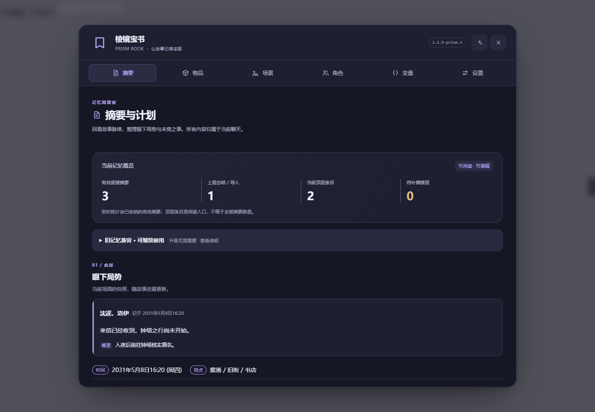

# 棱镜宝书 · Prism Book

**让故事记得来路。**

**SillyTavern 长期记忆扩展 · 修改版（公开分发）**

基于 [柏柏的 ST-BaiBai-Book](https://github.com/baibai-git/ST-BaiBai-Book) 修改。原作者与原项目出处保留，修改内容见 [CHANGELOG.md](CHANGELOG.md)，授权范围见 [NOTICE.md](NOTICE.md)。本版由维护者公开分发，不是原作者的官方发行版。

## 界面与品牌

1.2.9-prism.5 包含七个功能页：摘要与计划、札记、物品、场景、角色、变量、设置。统一卡片、表单与危险操作层级；移动端提供中文导航与分页列表。

- 主标题和默认悬浮入口采用简洁的书签图标与文字品牌；自定义悬浮图片优先，不会被覆盖。
- 日间、夜间、粉彩、木白、跟随 ST 五主题保留原 ID 和用户选择。
- 设置分为常用、记忆与召回、提示词、高级过滤、数据与迁移；目录可直接跳转。
- 手动重建保留在摘要页底部「高级维护 · 重建记忆」，有危险提示和二次确认。
- 弹窗支持 Tab 循环、Esc 关闭当前层及返回触发按钮；折叠控件不会接受隐藏键盘焦点。

上图为真实 Vue 组件在独立模拟宿主中的渲染，不含用户聊天；本地自动化通过不代表所有酒馆版本已完成实机验收。详见 [界面设计说明](docs/UI-DESIGN.md)。

## 本版重点

**升级不需要重建旧聊天。** 本版保留旧逐楼摘要、状态与 L1/L2 等总结的读取和注入；格式检查不通过时保护原数据，不把异常历史误判为全部未摘。支持范围及转换步骤见 [旧记忆接续说明](docs/LEGACY-COMPATIBILITY.md)。

“重建本聊天记忆”仍在摘要页面保留：已有摘要且可安全写入时可手动确认执行。它会请求 AI，替换成功楼层的旧摘要和状态更新，失败或取消可能留下部分已重建内容；不会删除剧情原文。执行前请备份。

- 摘要、总结和二次总结分别按层级取舍，优先保留关键变化、决定、条件及结果，而不是逐段缩写。
- 角色离场后按最后确认信息表达位置，不把旧位置当作持续实况。
- 保留仍有效的临时伤势，不凭时间或离场自动恢复；保留数值阈值与行动限制。
- 物品变动记录对模型可见但作为已处理信息，降低正文仿写和重复处理风险。
- 保留原数据键、宏、API、标签与生成拦截器，以减少旧数据迁移风险。
- 内部版关闭指向原作者仓库的更新检查和一键更新，使用完整安装包手动更新。

> 模型仍可能犯错。测试覆盖规则构造与程序行为，不保证所有模型、预设和剧情下的生成质量。

## 双子札记与摘要修复

- 新增「札记」页：保留原提示词，使用独立 API 地址、密钥和模型，默认关闭，不借用正文或摘要接口。见 [双子札记说明](docs/双子札记.md)。
- 已有 L1/L2 和旧摘要可直接作为札记上下文，无需为了升级全量重建；仅明确确认的安排可选择注入正文。
- 修复原文换行、Markdown 排版和来源编号导致的伤势/位置证据误拒；错误引文仍会被拒绝，不放宽事实校验。
- 摘要失败提示具体楼层与可展开诊断，保留已成功记录，支持局部补录/重摘。见 [摘要证据校验说明](docs/摘要证据校验说明.md)。
- 保留补录与重建入口；摘要和札记列表分页，减少长聊天一次渲染的内容。
- 大纲规划位于原有【计划】区：根据剧情与用户输入生成剧情要点和发展方式，确认后作为创作规划按阶段指导正文，不把未来计划当成已发生事实。默认复用札记 API，也可设置专用 API，见 [大纲规划说明](docs/大纲规划.md)。

## 安装

公开仓库文件上传齐全后，可在酒馆的扩展安装入口粘贴本仓库地址安装；下列步骤也适用于从完整安装包手动安装。安装本版前先停用并移出原版，不要同时加载两个版本。

支持范围沿用原插件声明：SillyTavern 最低版本 1.12.13；未在所有版本实机验收。

1. 备份酒馆数据、设置和原插件目录。
2. 停止酒馆，把旧柏宝书插件文件夹移到 **extensions 目录之外** 留作回退；不要仅在原地改个文件夹名。
3. 将完整的 ST-Prism-Book 文件夹放进对应用户的 extensions 目录。
4. 确认插件文件夹第一层有 manifest.json，且存在 dist/index.js 和 dist/index.css，不要多嵌套一层。
5. 启动酒馆并强制刷新页面，确认只启用一个版本。
6. 在摘要页查看兼容状态：已知 V3 直接沿用；可确定映射的 V2 经确认后本地转换；未知或损坏格式进入保护模式。不要为升级点击重建，先在聊天副本核对接续。

**不要同时启用原版和本版**：两者共用数据和公共接口。不要把私有仓库访问令牌写进安装URL或使用公共代理下载私有内容。

## 开发与验证

pnpm-lock.yaml 锁定依赖。在已安装受支持 Node.js 和 pnpm 的环境执行：

~~~sh
pnpm install --frozen-lockfile
pnpm test
pnpm typecheck
pnpm build
pnpm export:prompts
pnpm release:check
~~~

仓库保留源码和构建结果，以便内部成员无需构建即可安装。开发后必须同步提交重新构建的 dist 和 manifest，不能只改源码。

## 发布与维护

- 仓库名：ST-Prism-Book；按维护者决定以 **Public** 公开分发。
- 发布前阅读 [发布指南](docs/INTERNAL-RELEASE.md)。不包含自动部署、GitHub Pages或公开Release工作流。
- [公共API](PUBLIC_API.md) 保留兼容名称；[功能FAQ](FAQ.md) 来源于原项目并作品牌替换，更新行为以本README为准。
- 本版使用书签图标，不包含狐狸图片，见 [品牌说明](docs/LOGO-BRIEF.md)。

## 分发说明

当前版本为 1.2.9-prism.5，继承 prism.2 的旧记忆兼容接续；已完成本地自动化与隔离模拟宿主验证，仍建议先在真实酒馆的聊天副本中验收。界面中保留的“内部版”表示该维护分支的历史版本标识，不表示GitHub仓库为私有。仍采用手动更新，不会自动更新回原版。package.json中的private: true用于防止误发布到npm，不决定GitHub仓库可见性。
